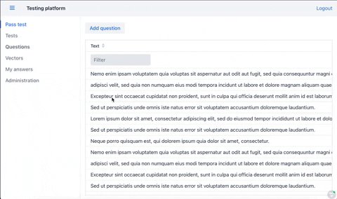
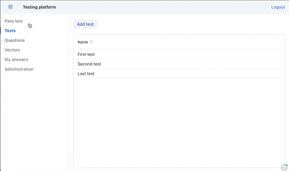

# Testing platform made with Vaadin and Spring Boot

This is a prototype testing platform where you can create tests with questions, 
set influence points for positive or negative answers.
This helps to determine psychological type of interviewer.

You are able to create tests with questions and set influence on each psychological type.

# Default user
user: admin@admin.com
pass: admin

## Running the Application
There are two ways to run the application :  using `mvn spring-boot:run` or by running the `Application` class directly from your IDE.

You can use any IDE of your preference,but we suggest Eclipse or Intellij IDEA.
Below are the configuration details to start the project using a `spring-boot:run` command. Both Eclipse and Intellij IDEA are covered.

#### Intellij IDEA
- On the right side of the window, select Maven --> Plugins--> `spring-boot` --> `spring-boot:run` goal
- Optionally, you can disable tests by clicking on a `Skip Tests mode` blue button.

Clicking on the green run button will start the application.

After the application has started, you can view your it at http://localhost:8080/ in your browser.

If you want to run the application locally in the production mode, use `spring-boot:run -Pproduction` command instead.

If you would like to run a separate test make sure you have added these parameters to VM Options of JUnit run configuration

## Setup AWS email service
- Create AWS email service at
https://aws.amazon.com/ru/getting-started/hands-on/send-an-email/
- Paste your credentials into src/main/resources/credentials.properties  
- Set your region and sender address in src/main/resources/application.yml

## Notes

If you run application from a command line, remember to prepend a `mvn` to the command.
